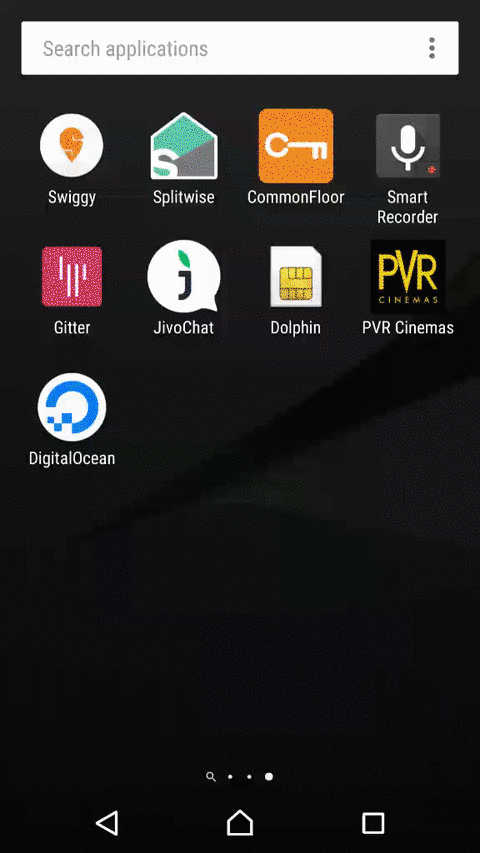

# DigitalOceanApp

Android App and Android Library for accessing the DigitalOcean API.
Originally made as a part of DigitalOcean CloudHackathon.

The library provides easy to use Java methods to make API calls to DigitalOcean.

The Android App lets people sign in with their Digital Ocean account. 
Once signed in, you can see your droplets, and their status. 
It has features such as - 
 - powering off / rebooting your droplet
 - turning backups on/off
 - taking snapshot of droplet
 - resizing droplet
 - creating a droplet

 ## Preview

 
