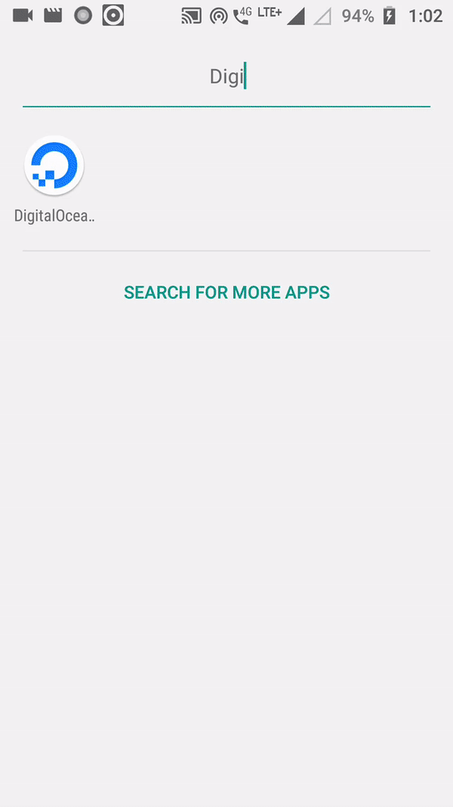

# DigitalOceanApp 

[Unofficial] Android App and Android Library for accessing the DigitalOcean API.
Originally made as a part of DigitalOcean CloudHackathon.

The library provides easy to use Java methods to make API calls to DigitalOcean.

The Android App lets people sign in with their Digital Ocean account. 
Once signed in, you can see your droplets, and their status. 
It has features such as - 
 - powering off / rebooting your droplet
 - turning backups on/off
 - taking snapshot of droplet
 - resizing droplet
 - creating a droplet

 ## Preview

 
 
 ### Automating Publishing to the Play Store
 
- The first APK or App Bundle needs to be uploaded via the Google Play Console because registering the app with the Play Store cannot be done using the Play Developer API.
- To use this plugin, you must create a service account with access to the Play Developer API. Once that's done, you'll need to grant the following permissions to your service account for this plugin to work (go to Settings -> Developer account -> API access -> Service Accounts).
- Once done download your PKCS12 key or json key somewhere and the location of key in the build.gradle file in the play block
- Then run one of the following commands:

   | Command | Description |
   | ------------- | ------------- |
   | 'publishApkRelease'| Uploads the APK and the summary of recent changes. |
   | 'publishListingRelease'| Uploads the descriptions and images for the Play Store listing.|
   | 'publishRelease'| Uploads everything.|
   | 'bootstrapReleasePlayResources'| Fetch data from the Play Store & bootstrap the required files/folders.|

                                
You can now type the following gradle commands such as the following:

bash
./gradlew publishApkRelease
                                

